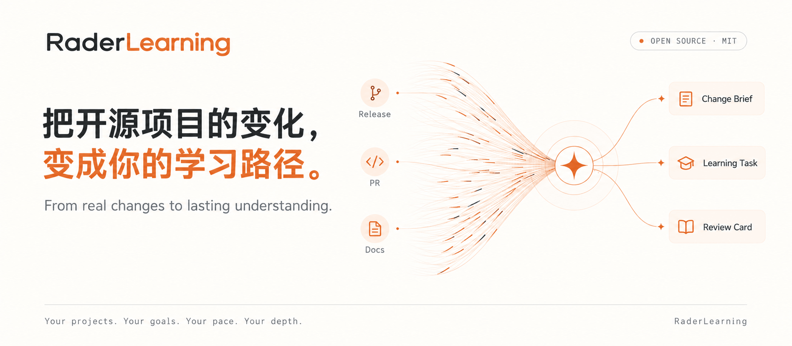
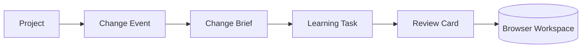
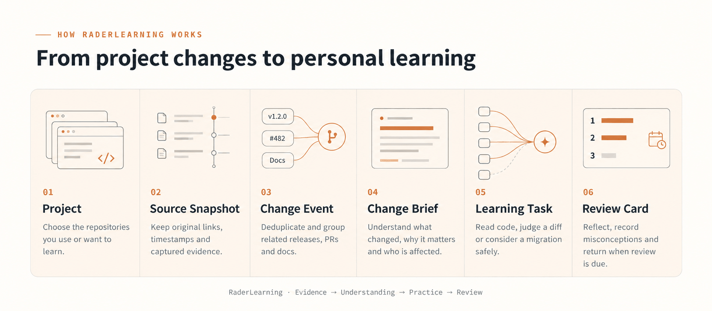
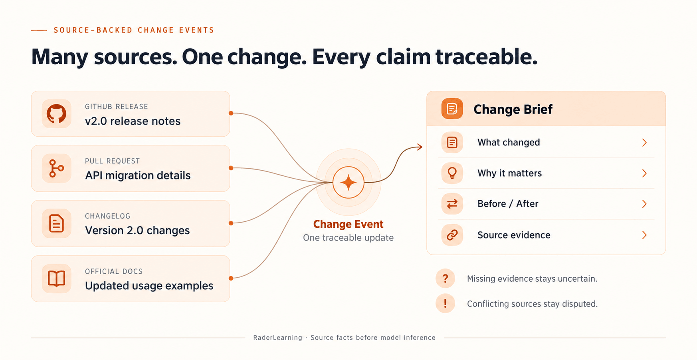
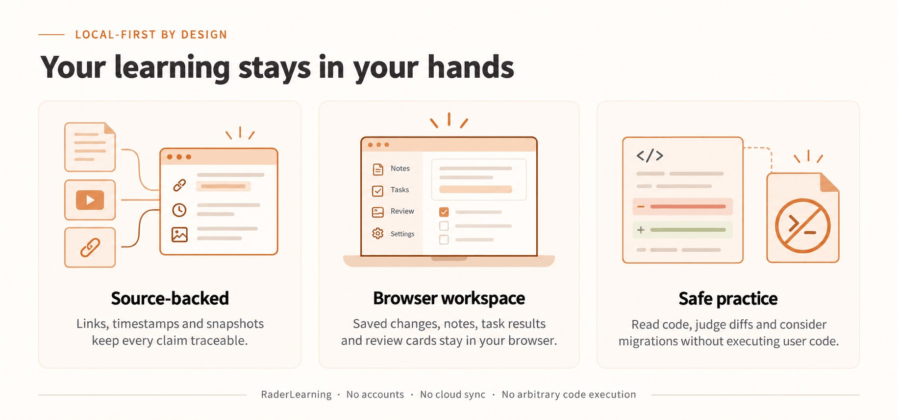
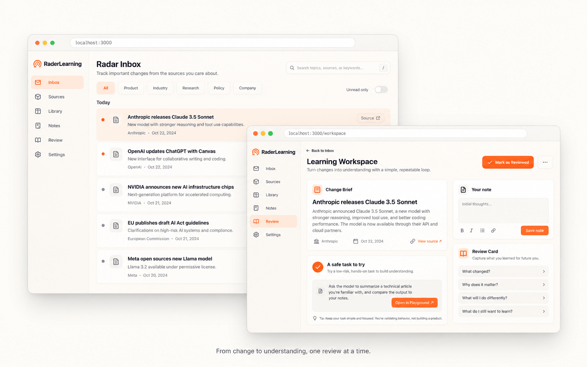
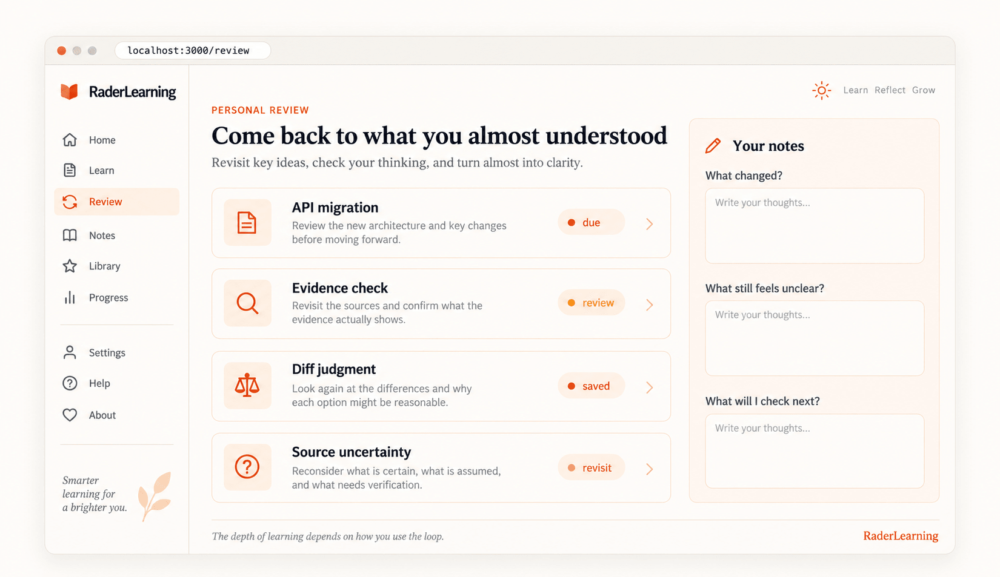

<p align="center">
  <picture>
    <source media="(prefers-color-scheme: dark)" srcset="docs/assets/banner-dark.png">
    
  </picture>
</p>

<p align="center">
  <a href="LICENSE"></a>
  
  
  
  <a href="https://github.com/ceyyy427/raderlearning"></a>
</p>

<p align="center">
  <b>把开源项目的真实变化，变成可理解、可练习、可复习的学习路径。</b><br>
  从项目雷达开始，到 Change Brief、Learning Task 和 Review Card，形成一条可追溯的学习闭环。
</p>

<p align="center">
  <a href="#跑起来">跑起来</a> ·
  <a href="docs/customize.md">改成你的行业</a> ·
  <a href="#它是怎么工作的">它是怎么工作的</a> ·
  <a href="#文档">文档</a> ·
  <a href="https://github.com/ceyyy427/raderlearning/discussions">社区交流</a>
</p>

<br>

## 这是什么

[RaderLearning](https://github.com/ceyyy427/raderlearning) 是一个面向个人开发者的开源学习工作区。它跟踪 GitHub Release、Issue、Pull Request、官方文档和 Changelog，把项目变化整理成有证据的学习内容：

```text
Project → Change Event → Change Brief → Learning Task → Review Card
```

它关注的不是“再生成一篇摘要”，而是让每条重要变化回答三个问题：发生了什么、为什么需要关心、怎样证明自己理解了。Radar 负责发现变化，Change Brief 解释影响，Learning Task 让读者完成一次安全练习，Review Card 把错误和复习时间留在自己的 Workspace 里。

这个仓库保留了完整的采集、判重、归组、来源快照、公开 API 和 Web 界面。内容必须能回到原始来源，来源冲突会显示为 `disputed`，证据不足时不会生成看似确定的结论。

### 我们坚持的设计

- **来源先于模型。** 模型可以帮助分类和解释，但不能补写来源没有说过的事实；每个 Change Brief 都保留来源链接和证据片段。
- **学习先于消费。** 页面按“变化 → 影响 → 练习 → 复习”组织，而不是让读者停在一段摘要上。
- **本地优先。** 项目和公开变化存放在服务端，个人保存项、任务结果、复习卡和笔记存放在当前浏览器；V0 不需要账号，也不做云端同步。
- **安全边界清晰。** V0 不执行用户代码；读者打开页面不会触发模型调用，模型只在后端任务中运行。



## 为什么开源

开源是因为每个人关注的项目和学习目标都不一样。你知道哪些信源值得盯、哪些变化会影响自己的系统，也知道哪些概念需要反复练习；RaderLearning 把采集、证据和学习循环交给你配置。

## 说在前面

- **我不是专业的开发者。** 我是设计师出身，半年前还看不太懂代码。这套代码是我和 AI 一起重写的，比以前干净了很多，但一定还有写得不好的地方。发现问题欢迎提 Issue，我不一定能很快回复，先说声抱歉。
- **这是一份快照。** 它来自 RaderLearning 正在线上跑的代码，不是精心打磨的通用框架。以后 RaderLearning 的更新，我会尽量同步过来，但没法保证每一次都同步。
- **里面没有 RaderLearning 的运营数据。** 仓库带了公开信源和示范配置，够你跑起来看效果；发布自己的站点前，请在 `industry/` 中确认站名、条款和品牌资源。

## 它是怎么工作的

<picture>
  <source media="(prefers-color-scheme: dark)" srcset="docs/assets/how-dark.png">
  
</picture>

一条资料从信源进来，先判重，再保留原始快照；可能重要的变化会被归组为 Change Event，经过证据检查后进入 Radar。读者从 Radar 打开 Change Brief，先看发生了什么和为什么重要，再完成一项不执行代码的 Learning Task，最后由本地 Review Card 安排复习。每一步的提示词都在 [`industry/prompts/`](industry/prompts/)，改标准不用改代码；完整运行方式见 [V0 runbook](docs/open-source-radar-v0-runbook.md)。

### 聚簇与热点

<picture>
  <source media="(prefers-color-scheme: dark)" srcset="docs/assets/cluster-dark.png">
  
</picture>

同一件事，官网发一篇、媒体转十篇、X 上吵一天，读者只需要看到一次。RaderLearning 把它们聚成一个**事件**：先用标题摘要的向量（没配向量服务时比文字重合度）在最近两周里找候选，再让模型判断是同一件事、后续进展，还是两件事；拿不准的合并，换一家模型再确认一遍。

**热度**按事件算，不按文章算：48 小时内，每个独立来源只算一次，24 小时减半。重复抓取不会多算，一家媒体发十篇也只算一次，所以排在前面的，是真正有很多人在说的事。

### 速度

<picture>
  <source media="(prefers-color-scheme: dark)" srcset="docs/assets/perf-dark.png">
  
</picture>

## 你会得到什么

| | |
|---|---|
| **项目雷达** | 关注 GitHub Release、Issue、Pull Request、官方文档和 Changelog；同一个项目变化只保留一个可追踪的 Change Event |
| **Change Brief** | 用原始来源回答“发生了什么、为什么重要、谁会受影响”；证据不足或来源冲突时明确显示不确定性 |
| **Learning Task** | 从变化中生成代码阅读、Diff 判断或迁移选择练习；只展示安全材料，不执行任意用户代码 |
| **Workspace / Review** | 在当前浏览器保存变化、任务结果、复习卡和纯文本笔记；错误回答会更快进入复习，掌握后延后复习 |
| **来源快照** | 保存来源 URL、内容哈希、抓取时间和状态；失败来源不会被伪装成成功内容 |
| **六种信源** | RSS、网页列表、JSON 接口、X 账号、微信公众号，以及你自己脚本推送进来的内容。信源分级（官方一手 / 媒体个人），抓取频率按产出自动调整 |
| **精选** | 预筛，同一份评分标准独立打两次分，再按信源分级的门槛决定入选；同一条新闻只占一条，换个说法的重复不进。提示词和门槛全部公开，全部可以改；用你自己标注的样本在 SelectBench 里校准 |
| **写作** | 中文标题、答案先行的摘要、推荐理由，外文全文翻译；分类、标签和新闻事实单独抽取；防止模型把原文没提到的公司写进标题 |
| **聚簇** | 不同来源报道的同一件事聚成一个事件，后续进展挂在同一个事件下，事件页有综述；进展和报道时间线可一起切换“最新在前”或“最早在前”；人工改过的归属不会被覆盖 |
| **热点** | 按事件算热度：独立来源越多越靠前，X 上的讨论也算进来；和 6 小时前比，涨得快的标上升，新出现的标“新” |
| **日报、周报、月报** | 每天 08:00 出日报，按规则编出当天要闻：一件事一条，报过的事只在有新进展时跟进，不调模型。每周一出周报、每月 1 日出月报，从日报里汇编，模型只写总述和栏目导读 |
| **主题与搜索** | 公司、方向、内容形态三类主题页，带近 12 个月的大事记（公司是横向编年史）；标题摘要搜索和全文相关搜索 |
| **给 Agent 用** | RSS（精选、全部、全文、日报、周报、月报）、公开 API、MCP、Agent Markdown、`llms.txt`，同一份内容给人看也给 Agent 用 |
| **后台** | 信源管理与试抓、内容诊断、精选评测、每一步单独换模型、付费服务的预算熔断、运行记录与告警 |
| **AI 专属模块** | 模型榜（汇总多家公开评测，方法公开）和 Codex 重置监控。别的行业一个开关关掉 |

## 看一眼

<picture>
  <source media="(prefers-color-scheme: dark)" srcset="docs/assets/shots-dark.png">
  
</picture>

<picture>
  <source media="(prefers-color-scheme: dark)" srcset="docs/assets/board-dark.png">
  
</picture>

<p align="center"><sub>截图来自用示范信源跑起来的本地站，站名是默认的 RaderLearning。</sub></p>

## 跑起来

想创建自己的独立站点，可以先点 [Use this template](https://github.com/ceyyy427/raderlearning/generate)，再克隆你生成的仓库。想持续合并上游更新或贡献代码，建议先 Fork。下面的命令适合直接试用。

需要 [Docker](https://docs.docker.com/get-docker/)，和一个 OpenAI 兼容的模型 API Key（DeepSeek、千问、智谱都可以）。

```bash
git clone https://github.com/ceyyy427/raderlearning.git raderlearning
cd raderlearning
node scripts/init-env.ts --llm-key <你的模型 API Key>
docker compose up -d --build
```

打开 <http://localhost:3000>。后台在 `/admin`，管理员密码在 `.env` 的 `ADMIN_PASSWORD` 里。一两分钟后开始有内容，第一次导入的资料大约半小时处理完。

机器上没有 Node、服务器在中国大陆、要配域名和 HTTPS，见 [部署](docs/deploy.md)。

## 把它改成你的行业

部署后打开 `/agent`，可以复制 Agent Markdown、MCP、RSS 或 API 的接入方式（默认打开 Agent Markdown，MCP 在 `/agent?tab=mcp`）。只支持网页读取的 Agent 从 `/api/v1/agent` 开始，那里列出精选、搜索、热点、事件、日报、周报和月报的 Markdown 地址。结构化数据用 `/api/v1/`，周报与月报在 `/api/v1/weeklies`、`/api/v1/monthlies`，追加 `/latest` 或一期的 ISO 周、月份即可读取；接口契约在 `/openapi-v1.json`。这些出口共同遵循文章撤回与全文许可，站名、链接和分类取自你的行业配置。

最省事的办法：打开你的 Agent（Claude Code、Codex 都可以），把这个仓库交给它，然后说：

```text
请读 AGENTS.md 和 docs/customize.md，把这个站改成「法律」行业的热点站。
我关心的是：……（你想盯哪些信源，你觉得什么消息重要、什么不重要，越具体越好）。
```

要改的东西几乎都在 [`industry/`](industry/) 这一个文件夹里，代码基本不用动：

| 文件 | 改什么 |
|---|---|
| `site.ts` | 站名、行业词、首页文案、关于页 |
| `taxonomy.ts`、`topics.json` | 分类、标签、主题 |
| `chronicle.ts` | 主题页“大事记”的规则；公司的人工历史放 `chronicles/`（可选） |
| `sources.json` | 首次启动时导入的信源 |
| `prompts/` | 精选标准和写作要求。**你的行业 KnowHow，就写在这里** |
| `selection.ts` | 入选门槛 |
| `features.ts` | 模型榜、Codex 重置监控的开关 |
| `brand/`、`pages/` | 图标、使用规则和隐私说明 |

最值得花时间的是评分标准（`prompts/selection-score.md`）和门槛：拿一两百条你自己标注过的资料，用 `scripts/eval-selection.ts` 跑一遍，看它选得准不准，再回去改。怎么做写在 [精选与校准](docs/selection.md) 里。

## 文档

| 文档 | 内容 |
|---|---|
| [把它改成你的行业](docs/customize.md) | 站名、分类、主题与大事记、信源、提示词、门槛、品牌，一步一步来 |
| [信源](docs/sources.md) | 六种信源怎么配，分级和全文，外部推送接口 |
| [精选与校准](docs/selection.md) | 一条资料怎么变成精选、怎么编进日报周报月报，怎么用自己的样本校准 |
| [事件归组与关系评测](docs/grouping.md) | 事件关系怎么判断，怎么用自己的 pairwise gold set 评测 |
| [部署](docs/deploy.md) | Docker、域名和 HTTPS、中国大陆、更新、备份、花多少钱 |
| [架构](docs/architecture.md) | 三个进程、几条不变的规则、目录、对外出口 |
| [模型榜与 Codex 重置监控](docs/leaderboard.md) | 两个 AI 专属模块 |

技术栈：Node.js 24 · TypeScript · React Router（服务端渲染）· Fastify · PostgreSQL · pg-boss · Tailwind CSS · Docker Compose。

## 交流与贡献

部署和使用问题到 [问答区](https://github.com/ceyyy427/raderlearning/discussions/categories/q-a)，新想法到 [想法交流区](https://github.com/ceyyy427/raderlearning/discussions/categories/ideas)，欢迎在 [作品展示区](https://github.com/ceyyy427/raderlearning/discussions/categories/show-and-tell) 分享你做出的行业热点站。

发现 Bug 或有明确的功能建议，可以 [提交 Issue](https://github.com/ceyyy427/raderlearning/issues/new/choose)。准备改代码前，先看 [贡献说明](CONTRIBUTING.md)；安全漏洞请走 [私密报告入口](SECURITY.md)。

## 最后

RaderLearning 曾经只是我无数个深夜里，一个很小、很小的念头。

我不知道它会被改成什么样子，会走到多远的地方。但这可能就是开源最浪漫的地方。

剩下的路，就交给你们了。

<p align="right">—— 数字生命卡兹克</p>

## 许可

代码使用 [MIT 许可证](LICENSE)。品牌资产和第三方标志各有自己的许可和商标归属。字体、模型厂商和评测来源的标志各有自己的许可和商标归属，见 [NOTICE](NOTICE)。

---

<sub>**In English:** RaderLearning ([github.com/ceyyy427/raderlearning](https://github.com/ceyyy427/raderlearning)) is a local-first learning workspace for individual developers. It tracks open-source project changes, keeps source-backed snapshots, groups them into Change Events, and turns important changes into Change Briefs, safe Learning Tasks, and browser-local Review Cards. Evidence stays linked to the original source, disputed or failed evidence remains visibly uncertain, and V0 executes no arbitrary user code or cloud sync. Use `AGENTS.md`, `docs/customize.md`, and the V0 runbook to adapt the workspace to your own projects and learning goals.</sub>
